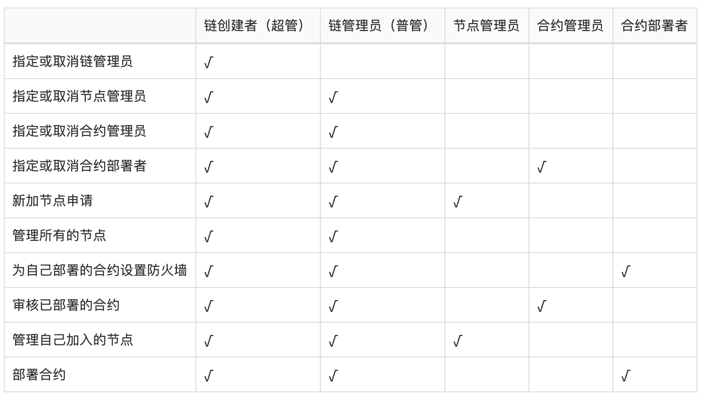

## 1. 区块链

自2009年比特币的创世区块诞生，到2014年区块链概念的提出，区块链技术经历了启蒙、认知、探索阶段，近些年已在金融、商业、组织协作与治理等各方面逐渐呈现出了其价值，受到各实体行业乃至国家战略层面的重视。区块链在2015世界经济论坛被列为未来六大趋势之一，也被Gartner列入企业组织在2019年需要探究的十大战略性技术。2016年12月15日，在国务院印发的《“十三五”国家信息化规划》中，强调了需加强区块链等新技术的创新、试验和应用，来抢占新一代信息技术主导权。

### 1.1 基本概念

#### 1.1.1 链式结构和存储

区块链：由一个个区块前后链接组成，是“使用密码技术将共识确认的区块按顺序追加形成的分布式账本”

区块：每一个区块包含了前一个区块的哈希、相应的时间戳以及交易数据等；区块链中第一个区块通常称为“创世区块”

交易数据：交易的原始数据以及使用这些交易数据构造的默克尔树的根哈希都存储在区块中，这意味着交易数据的篡改将导致区块中的数据被改动

#### 1.1.2 共识

区块链通过共识算法达成如下共识：

* 交易的有效性：交易被验证有效
* 交易集合和顺序的一致性：区块链账本中交易的集合和顺序在各节点中是一致的

在区块链领域，采用PoW（工作量证明算法）、PoS/DPoS（权益证明算法/代理权益证明算法）与类BFT算法等结合的共识算法，这些是业界主流的共识算法。与经典分布式一致性算法（Raft, Paxos, etc.）不同的是，它们融入了经济学博弈的概念。

#### 1.1.3 智能合约

智能合约概念是 90 年代由Nick Szabo首次提出，是指是一种旨在以信息化方式传播、验证或执行合同的计算机协议，且不依赖于第三方。

这个概念在以太坊中被首次实现并为大众所熟知。但是在以太坊和今天的区块链行业中，智能合约现在通常是指一段运行在区块链上的通用程序，不再局限于合约。

### 1.2 联盟链

按照许可和权限维度划分，当前区块链可分为公有链、联盟链和专有链。

公有链即无须许可的区块链系统，任何个体都可以自由进入和退出，也可以在其中写入、读取、参与交易，如比特币、以太坊等。

联盟链指由联盟成员维护的区块链，通常设计有线下认可的节点准入、用户管理和权限控制机制。联盟链可大幅降低异地结算成本和时间，比现有系统更简单，效率更高，同时继承去中心化优点减轻垄断压力。

专有链指各个节点的写入权限收归内部控制，而读取权限可视需求有选择性地对外开放。专有链具备区块链多节点运行的通用结构，适用于含多级机构的组织进行内部数据管理与审计。

#### 1.2.1 联盟链的特点

权限控制：

* 准入权限：具备此权限的节点才可以接入网络；
* 共识权限：具备此权限的节点才可以参与区块链的共识；
* 业务权限：对链上的操作进行更细粒度的权限设定，比如部署合约、管理角色等；

安全隐私：

* 通过权限控制，严格的保护数据隐私，避免数据泄露；
* 通过密码学技术，在不泄露数据的前提下，进行数据交互；

共识效率：

* 基于企业应用场景，可以牺牲部分不需要的去中心化程度，提高共识效率

共识安全:

* 安全稳定的共识算法，不可分叉

## 2. 联盟区块链平台 - PlatONE

### 2.1 基本概念

* 节点
  * PlatONE中的节点主要有以下几类：
    * 观察者节点: 只负责同步区块，不参与出块。系统中将会一直存在几个稳定的观察者节点，用于稳定同步区块，同时也用于被其他的节点指定为bootnodes进行连接;
    * 共识节点: 参与出块，以及同步区块;

* 账户
  * 相比账户模型，UTXO不支持智能合约，而很多的DAG项目也在积极探索智能合约，但是还没有成熟稳定的解决方案，因此PlatONE选择成熟稳定支持智能合约的账户模型。PlatONE中，每个账户都有一个与之关联的状态(state)和一个20字节的地址(address)。账户分为两类：
    * 普通账户: 该类型账户由私钥控制，用户可通过钱包客户端生成。在PlatONE中，普通账户可以创建交易，并使用私钥对交易签名。普通账户除保存账户余额外，智能合约可被授权扩展和访问自定义属性。
    * 合约账户: 该类型账户没有私钥，由代码控制，合约账户地址在部署合约时产生。与普通账户不同，合约账户不能自行发起新的交易。每当合约账户收到一条消息，合约内部的代码就会被激活，允许它对内部存储进行读取和写入，以及发送其它消息或者创建合约。

* 智能合约(Wasm介绍)
  * Wasm合约支持高级语言开发，编译成wasm执行。触发Wasm合约的交易由共识节点打包，全网节点重复执行验证。Wasm合约的状态保存在公共账本中。

  * 可验证合约的开发和发布跟Wasm合约没有区别，最终也是编译成wasm执行。可验证合约的状态转换在链下由计算节点异步执行，计算完成后新的状态和状态转换证明提交到链上，全网节点可快速验证正确性并将新的状态更新到公共账本中。可验证合约可支持复杂、繁重的计算逻辑而不影响整条链的性能。

  * 隐私合约同样支持高级语言开发，编译成llvm ir中间语言执行。隐私合约的输入数据保存在数据节点本地，由数据节点在链下以安全多方计算方式进行隐私计算，并提交计算结果到链上。

### 2.1.1 PlatONE中的共识算法

PlatONE的共识为高度优化的BFT类共识算法，其容错率为1/3，在保留即时确认（instant finality）的关键特性的同时，极大地提高了去中心化的程度。共识可以保证上链的区块是确定的，也就是说链不会出现分叉，同时每一个有效的区块都会插入到链上。

PlatONE的共识支持超过100个共识节点。相对于其他一些常见的BFT共识，PlatONE的共识的性能有显著的提升。在10个共识节点的情况下，TPS 接近 1000。

PlatONE的共识运行的相关参数可以灵活地进行配置，并且 PlatONE的共识中的共识节点集合可以灵活地进行更新。近期计划支持共识的插件化，以及共识的可审计性等。

PlatONE共识是在 round 上进行的。在特定的 round 上，通过预先设置的策略选取一个出块者节点。出块者节点的选取策略目前支持两种：round robin 和 sticky proposer。

出块者节点提议区块后，各共识节点进行共识。共识分三阶段，其中后两个阶段为投票阶段，用以保证 safety。PlatONE共识使用 round change 机制结合锁定和解锁机制来保证共识的的 liveness 。通过优化解锁机制，解决了业界多个知名项目内存在的共识死锁问题。

PlatONE共识会为每一个链上的区块生成共识证明，也就是对于该区块的各共识节点的有效签名，因而区块可以进行自验证，同时也能支持轻节点。

### 2.1.2 PlatONE中的权限模型

根据系统中的不同实体对象，PlatONE将权限管理进行了模块化的拆分。针对系统中用户账户、节点和智能合约，这三类实体的不同行为，分别设计了用户角色管理模块、节点管理模块和合约防火墙模块来进行权限的控制和管理。

* 角色管理

  PlatONE根据不同的权限，设定了不同的用户角色，并通过系统合约的方式对用户的角色进行管理。根据不同的角色，用户在系统中被赋予不同的权限。目前设定了如下角色：

  每个角色的权限范围如下：

* 节点管理

  PlatONE通过节点管理合约对节点进行管理，包括节点是否能够接入网络，节点是否能够参与共识以及节点信息的维护等功能。根据之前用户角色的设定，只有chainCreator、chainAdmin和nodeAdmin这三类用户才可以设置系统合约中的节点数据，当需要添加节点、更新节点状态、删除节点时都需要这三类账户来调用节点管理合约。需要注意的是nodeAdmin仅可以管理自己加入的节点，chainCreator和chainAdmin可以管理所有节点。

* 合约防火墙

  PlatONE中合约的调用权限由合约防火墙控制，只有合约的创建者才可以设置该合约的防火墙。

  合约防火墙具备合约接口级别的访问控制，通过如下两个列表实现：

  * ACCEPT: 可以访问相应接口的地址列表，相当于白名单
  * REJECT: 拒绝访问相应接口的地址列表，相当于黑名单

### 2.2 架构图

### 2.3 功能介绍

* 共识算法
    * [IBFT](../重要功能/共识算法/IBFT/Istanbul共识.md)
    * [VRF](../重要功能/共识算法/VRF/PlatONE 共识结合 VRF 机制.md)
* 智能合约
    * [合约数据迁移](../重要功能/智能合约/合约数据迁移.md)
    * [GasFee](../重要功能/智能合约/自定义Gas扣费功能.md)
    * [隐私货币](../重要功能/智能合约/隐私密码货币.md)
    * 虚拟机
        * [WASM](../重要功能/智能合约/WASM虚拟机.md)
        * [EVM](../重要功能/智能合约/EVM虚拟机.md)
* [CNS](../重要功能/CNS/CNS-功能介绍.md)
* [权限模型](../重要功能/权限模型/权限模型-功能介绍.md)
* [密码学方案](../重要功能/密码学方案/密码学方案简要介绍.md)
