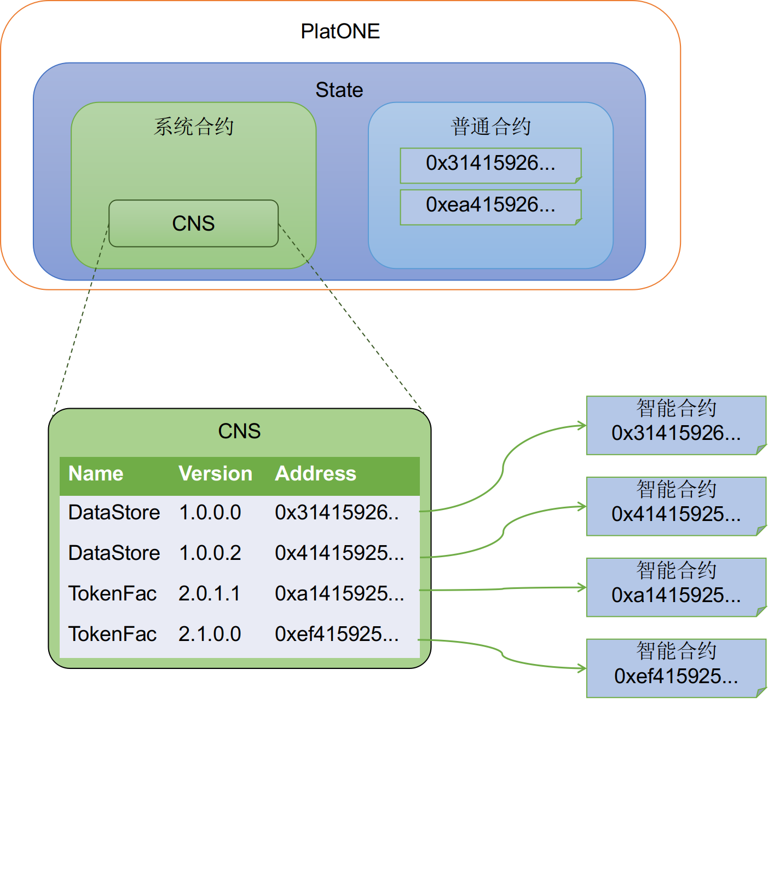

# 合约命名服务CNS

在目前主流的区块链中，用户是通过地址来访问智能合约的，比如以太坊。智能合约的地址是一段十六进制字符串，用户需要记住这段冗长的字符串才能访问链上的智能合约。当合约需要升级时，重新部署合约又会产生新的地址，所有依赖于该合约的模块都需要做相应更新。显然现有访问合约的方式对用户是不友好的，因此我们在PlatONE中实现了合约命名服务，用户可以通过合约名称及版本号来访问智能合约。

合约命名服务英文全称为Contract Name Service，简称CNS。合约命名服务维护了名称、版本到合约地址的映射关系，提供了对系统中合约的管理功能，包括合约的注册和注销，合约注册信息和地址的查询等功能。

PlatONE使用系统合约实现了合约命名服务，用户部署合约后可以将该合约注册到系统合约中，后续调用可以通过合约名称及版本进行调用，而无需使用合约地址。如果交易是根据合约名称、版本来调用合约，PlatONE底层自动在系统合约中查询名称版本对应的合约地址，然后调用该地址的合约。

