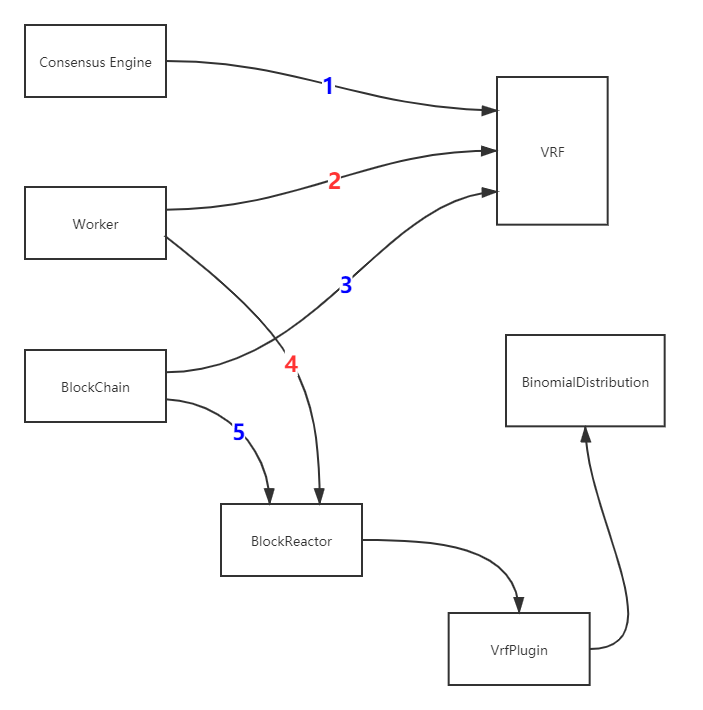
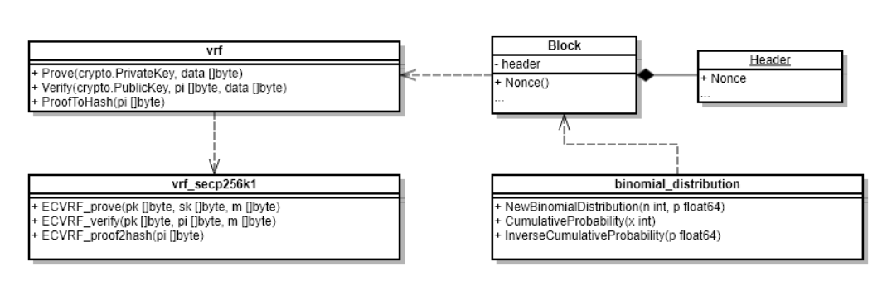

# VRF机制

## 1. 概述

共识算法作为区块链的核心组件，面临着一个重要的权衡问题，即共识节点数量和共识性能之间的权衡。尽管共识节点数量越多，意味着更高的去中心化程度，但与此同时会导致共识的性能的降低。在 PlatONE 中，共识算法为 BFT 类共识，随着共识节点数量的增多，共识消息的数量也随之增多，导致区块链的 TPS 的降低。

为了在共识节点数量和共识性能之间进行一个较好的折衷，PlatONE 中采用随机选取共识节点集合的机制，即通过从较多数量的候选共识节点中随机地选取一定数量的节点成为某一周期中具体参与共识的节点。如此便能在保证较好的去中心化的程度以及安全性的同时，又能够提供较好的共识性能。

PlatONE 中随机选取共识节点的机制基于 VRF。VRF 即可验证随机函数（Verifiable Random Function） 。 VRF 这个概念最早由 Micali，Rabin 和 Vadhan 三个人所提出。它是一个伪随机函数，同时对其输出结果提供可公开验证的证明。 即给定一个输入值 $x$，拥有私钥 $sk$ 的人可以计算一个函数值 $y=F_{sk}(x)$ 以及证明 $\pi=P_{sk}(x)$。 利用证明 $\pi$ 和公钥 $PK=g^{sk}$，每个人都可以验证 $y=F_{sk}(x)$ 是否为用该算法计算出来的，并且不会泄露任何关于私钥 $sk$ 的信息。 目前 VRF 的构造方案都是基于随机预示模型下的，主要有两大类：其中一类采用的是 RSA 来构造 VRF，即 RSA VRF。另一种使用的是椭圆曲线密码学来构造 VRF ，即 EC VRF。本文介绍的 VRF 方案中使用的是 EC VRF。

## 2. 共识和 VRF 算法交互设计

### 2.1. 交互图

VRF 机制涉及的算法主要包括以下两个：

* **VRF**

  在出块节点打包完区块之后为该区块生成一个随机数和证明（proof），并且存储到区块中，当其它节点接收到该区块时对证明和随机数校验是否正确。

* **二项分布**

  在选举共识节点的时候通过使用二项分布来根据每个共识候选节点的权重计算出每个候选节点的概率，这样根据每个节点的概率去做选举，概率越高被选中的几率越高。为了增加选举的随机性，计算概率时选择使用 VRF 生成的随机数来进行。

根据上图中的数字颜色可划分为两类交互流程来触发上述两种算法：

**红色数字：**属于出块节点触发，包括以下流程（图中数字表示）

- **2：**由 Worker 完成出块之后，调用 VRF 生成证明和随机数并且存储到该区块中
- **4：**由 Worker 执行完交易，调用 VrfPlugin。如果需要选举共识节点，则调用二项分布算法

**蓝色数字：**属于非出块节点触发（图中数字表示）

- **1：**由共识节点在 consensus engine 接收到区块时，校验该区块的 VRF 输出值是否正确
- **3：**由非共识节点同步区块后，校验该区块的 VRF 输出值是否正确
- **5：**由非共识节点同步区块后，调用 VrfPlugin。如果需要选举共识节点，则调用二项分布算法

### 2.2. 类图

共识节点的选举是由 VRF 和二项分布结合来执行的。两个算法是相互独立地触发和执行的，只是二项分布的概率计算依赖于 VRF 产生的随机性，通过随机性可实现权重高低的概率性，具体说明如下：

- 区块产生后，为区块生成 VRF 证明和随机数并且存储到区块中；随机数用作选举共识节点，证明用作证明该随机数是由该出块节点根据前一个区块的随机数产生的
- 在选举共识节点的时候就需要使用前 N 个区块的随机数对应分配给 N 个节点来和当前区块的随机数进行异或运算，计算之后的值作为二项分布的输入值来计算概率
- 每个节点被分配的随机数不同，所以计算后每个节点的二项分布的输入值也就不同，所获取的二项分布累积分布曲线上的点就不同，因此产生了概率性

### 2.3. 存储

**1. **`Header`中原有字段`Nonce`，该字段类型为`[]byte`，用作存储 VRF 的证明（证明字段详解见接口说明）

**2.** 由于选举共识节点需要往前 N 个（也就是候选者节点的个数）区块的随机数，所以这些随机数需要以合适方式进行存储以方便读取。

由于 N 代表的是待选举的节点数量，是不定的数字，因此可以缓存前若干个预先确定数量的区块的随机数。该预先确定数量目前暂定为 100，且该数字可以在节点启动命令行中通过相应的 flag（暂定 --nonceCache） 进行按需设置。

### 2.4. 算法具体业务逻辑

#### 2.4.1. VRF 相关

1. **生成证明**：由出块节点在`worker`的`commitNewWork`中执行交易前，调用`VRF`的`Prove`函数对该区块生成证明和随机数并存储到`Header`中的`Nonce`字段
2. **共识节点接收区块**：由共识节点在接收到提议区块后，调用`VRF`的`Verify`函数对该区块的证明校验是否正确
3. **非共识节点同步区块**：这里非共识节点包括本周期选举前的共识候选节点以及观察者节点。同步分为两部分，分别是`downloader`和`fetcher`模块，它们同步区块之后最终调用`blockChain`的`InsertChain`函数处理区块，在`InsertChain`函数中调用`VRF`的`Verify`函数对该区块的证明校验是否正确

#### 2.4.2. 二项分布相关

1. **出块节点**：在选举过程触发时，`worker`中执行完交易之后调用 VrfPlugin 的`Election`函数，该函数调用`binomial_distribution`选举共识节点
2. **非出块节点**：在选举过程触发时，`blockChain`中执行完交易之后调用 VrfPlugin 的`Election`函数，该函数调用`binomial_distribution`计算出共识节点。
3. **选举触发条件**：参数管理合约中，VRF 选举标志被触发时，通过 Config 模块的事件通知方式通知到 VRF 模块，从而触发 VRF 共识节点选举的过程。

#### 2.4.3. binomial_distribution 选举流程

1. 获取待选举的共识候选节点列表
2. 获取当前区块的随机数（从`Block`中调用`Nonce`函数返回证明，再调用`VRF`的`ProofToHash`函数返回随机数）
3. 根据缓存中保存的随机数获取前 N 个区块的随机数，若缓存的随机数个数不足 N 个，则从链上读取剩余的区块的随机数
4. 计算单个权重被选中的概率，p=(待选举列表总权重/待选举列表人数)*选举人数/待选举列表总权重
5. 每个共识候选节点调用`NewBinomialDistribution`函数，并将各自的n(权重)、和上一步得到的p(概率)，传入函数中实例化一个对象
6. 分配随机数给每个候选节点，并与当前区块的随机数做异或，得出的值再除以(2的256次方-1)得出0~1之间的概率值`targetP`
7. 每个候选人调用`InverseCumulativeProbability`函数，并把上一步得到的概率值`targetP`作为参数传入到函数中，得出`targetP`所属的累积分布曲线上的`x`值
8. 最终根据每个验证人计算所得的 x 值进行倒序排序，取前面 V 个验证人作为下一周期的共识节点。其中 V 是共识节点的个数。V 的值从 config 模块获取，即每次 VRF 选举触发时，从参数管理合约中获取的，由 Config 模块以参数形式放在事件通知中传递过来。

**下图为前N个区块的随机数异或规则：**（N 的实例取值为 101）

按共识候选节点的排名（默认按照节点在数组中的顺序），依次将前 N=101 个区块的随机数分配给各个共识候选节点。例如：往前1个区块的随机数分配给最后一名候选节点，往前第2个块的随机数分配给倒数第二名候选节点，以此类推，并且每个候选节点还拥有当前区块的随机数。

### 2.5. 关于节点的类型

对应着 VRF 的设计，在节点管理合约中，节点类型会有如下几种：

* **观察者节点**

  不参与共识节点的选举，只同步区块

* **共识候选节点**

  参与共识节点的选举；如果没有在本共识周期中被选为共识节点，则同样进行区块同步

* **共识节点**

  在本共识周期内从候选节点被选举为共识节点，参与共识的运行。在下一共识周期中，所有类型为共识节点和共识候选节点的节点都将参与 VRF 共识节点的选举过程。也就是说，只有观察者节点类型的节点不参与共识节点的选举。

### 2.6. 关于节点的属性
节点的属性，除已有的之外，还包括：

* 节点的权重（目前节点的权重默认相同）

### 2.7. 算法接口

------

#### 2.7.1. vrf_secp  256k1

> 使用secp256k1曲线的vrf算法实现

ECVRF_prove函数

> 该函数用于根据输入数据来生成随机数和证明，随机数和证明是拼接在同一个byte数组里面的，前1~33位为随机数

入参：

| 参数名称 | 参数类型 | 描述     |
| -------- | -------- | -------- |
| pk       | []byte   | 公钥     |
| sk       | []byte   | 私钥     |
| m        | []byte   | 原始数据 |

出参：

| 参数名称 | 参数类型 | 描述         |
| -------- | -------- | ------------ |
| pi       | []byte   | 随机数和证明 |
| err      | error    | 失败错误     |

ECVRF_verify函数

> 该函数用于校验随机数和证明，是否属于该公钥生成、是否基于该原始数据生成

入参：

| 参数名称 | 参数类型 | 描述         |
| -------- | -------- | ------------ |
| pk       | []byte   | 公钥         |
| pi       | []byte   | 随机数和证明 |
| m        | []byte   | 原始数据     |

出参：

| 参数名称 | 参数类型 | 描述     |
| -------- | -------- | -------- |
| success  | bool     | 是否正确 |
| err      | error    | 失败错误 |

ECVRF_proof2hash函数

>该函数用于从证明中解析出随机数

入参：

| 参数名称 | 参数类型 | 描述         |
| -------- | -------- | ------------ |
| pi       | []byte   | 随机数和证明 |

出参：

| 参数名称     | 参数类型 | 描述                       |
| ------------ | -------- | -------------------------- |
| randomNumber | []byte   | 从证明pi中解析出来的随机数 |

#### 2.7.2. vrf

> 该类是对具体实现算法的封装，不暴露具体曲线，只对外提供通用的接口和参数，然后调用具体实现算法类，构造所需参数传递过去

Prove函数

> 生成证明和随机数

入参：

| 参数名称   | 参数类型         | 描述     |
| ---------- | ---------------- | -------- |
| privateKey | ecdsa.PrivateKey | 私钥     |
| data       | []byte           | 原始数据 |

出参：

| 参数名称 | 参数类型 | 描述         |
| -------- | -------- | ------------ |
| pi       | []byte   | 随机数和证明 |
| err      | error    | 失败错误     |

Verify函数

> 校验证明和随机数是否正确

入参：

| 参数名称  | 参数类型        | 描述         |
| --------- | --------------- | ------------ |
| publicKey | ecdsa.PublicKey | 公钥         |
| pi        | []byte          | 证明和随机数 |
| data      | []byte          | 原始数据     |

出参：

| 参数名称 | 参数类型 | 描述     |
| -------- | -------- | -------- |
| success  | bool     | 是否正确 |
| err      | error    | 失败错误 |

ProofToHash函数

> 通过证明解析出随机数

入参：

| 参数名称 | 参数类型 | 描述         |
| -------- | -------- | ------------ |
| pi       | []byte   | 证明和随机数 |

出参：

| 参数名称     | 参数类型 | 描述                       |
| ------------ | -------- | -------------------------- |
| randomNumber | []byte   | 从证明pi中解析出来的随机数 |

#### 2.7.3. binomial_distribution

> 二项分布算法的实现

NewBinomialDistribution函数

> 实例化一个二项分布对象，用作计算概率曲线的，由两个参数来构成：次数和概率

入参：

| 参数名称 | 参数类型 | 描述                               |
| -------- | -------- | ---------------------------------- |
| n        | int      | 权重值（伯努利实验的次数）         |
| p        | float64  | 成功概率值（单次伯努利实验的概率） |

出参：

| 参数名称             | 参数类型             | 描述           |
| -------------------- | -------------------- | -------------- |
| binomialDistribution | BinomialDistribution | 二项分布结构体 |

CumulativeProbability函数

>累积分布函数，计算曲线上到某点（某次）为止的范围的概率值

入参：

| 参数名称 | 参数类型 | 描述 |
| -------- | -------- | ---- |
| x        | int      | 次数 |

出参：

| 参数名称 | 参数类型 | 描述          |
| -------- | -------- | ------------- |
| ret      | float64  | x点上的概率值 |

InverseCumulativeProbability函数

> 累积分布函数，通过概率值反向计算出概率所属的某点的值x

入参：

| 参数名称 | 参数类型 | 描述                 |
| -------- | -------- | -------------------- |
| p        | float64  | 某点（某次）的概率值 |

出参：

| 参数名称 | 参数类型 | 描述                  |
| -------- | -------- | --------------------- |
| x        | int      | 概率值对应的某点的x值 |
