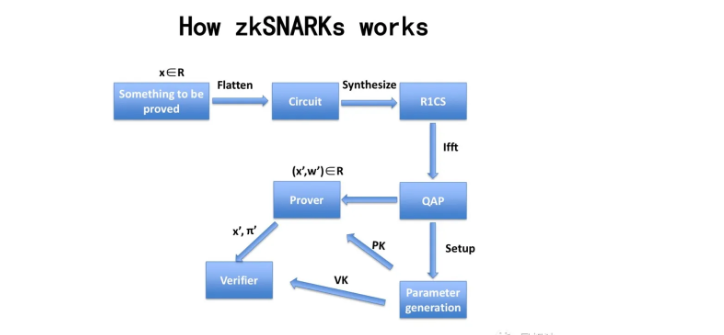
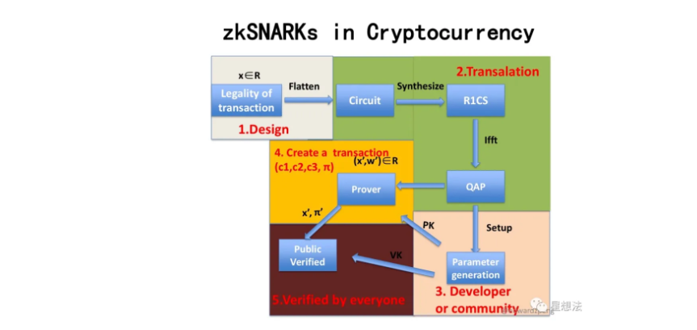

# 国密sm2算法

## 1. 概述

SM2算法是中华人民共和国政府采用的一种公钥加密标准，由国家密码管理局于2010年12月17日发布。在商用密码体系中，SM2用于替换RSA算法，可用来实现非对称加密、数字签名、密钥交换等功能。作为一种基于椭圆曲线的公钥密码算法，SM2算法在相同安全程度下，较RSA算法在密钥规模上存在优势。

|          | SM2        | RSA          |
| -------- | ---------- | ------------ |
| 密钥规模 | 192-256bit | 2048-4096bit |

算法标准包括4个部分：

    1. 总则，适用于基域为素域和二元扩域的椭圆曲线公钥密码算法；
    
    2. 数字签名算法，适用于商用密码应用中的数字签名和验证，可满足多种密码应用中的身份认证和数据完整性、真实性的安全需求；
    
    3. 密钥交换协议，适用于商用密码应用中的密钥交换，可满足通信双方经过两次或可选三次信息传递过程，计算获取一个由双方共同决定的共享秘密密钥（会话密钥）；
    
    4. 公钥加密算法，适用于商用密码应用中的消息加解密，消息发送者可以利用接收者的公钥对消息进行加密，接收者用对应的私钥进行解密；

相关标准为“GM/T 0003.1-2012 SM2 椭圆曲线公钥密码算法第1部分：总则”，“GM/T 0003.2-2012 SM2 椭圆曲线公钥密码算法第2部分：数字签名算法”，“GM/T 0003.3-2012 SM2 椭圆曲线公钥密码算法第3部分：密钥交换协议”，“GM/T 0003.4-2012 SM2 椭圆曲线公钥密码算法第4部分：公钥加密算法”，“GM/T 0003.5-2012 SM2 椭圆曲线公钥密码算法第5部分：参数定义“。

## 2. 签名算法

数字签名是附加在数据单元上的一些数据，或是对数据单元所作密码变换的结果，当正常应用时提供如下服务：

 + 数据来源的确认；
 + 数据完整性的验证；
 + 签名者不可抵赖的保证。

数字签名算法由一个签名者对数据产生数字签名，并由一个验证者验证签名的可靠性。每个签名者有一个公钥和一个私钥，其中私钥用于产生签名，验证者用签名者的公钥验证签名。

在签名的生成过程之前，要用密码杂凑函数（哈希函数）对消息M (包含$Z_A$和待签消息M)进行压缩。

同理，在验证过程之前，要用密码杂凑函数对$M
′$ (包含$Z_A$和验证消息$M′$ )进行压缩。

### 2.1. 系统参数

椭圆曲线的系统参数为：

- $F_q$：包含 $q$ 个元素的素域
- 椭圆曲线方程的参数a、b
- $G$：椭圆曲线的基点（$G=(x_G,y_G)$）
- $n$：基点G的阶，由基点$G$生成的群的元素的个数
- 可选项：n的余因子$h$（$h = |E(F_q)|/n$）

除了定义了椭圆曲线的参数和签名算法所需要的辅助函数：哈希函数和随机数发生器外，标准引入了用户信息标识的概念。

签名者拥有长度为$entlen_A$比特的可辨别标识$ID_A$，在标准规定的签名算法中，需要在生成签名和验证签名前计算用户A的哈希值$Z_A$。$Z_A=H_{256}(ENTL_A||ID_A|| a||b||x_G||y_G||x_A||y_A)$，其中$ENTL_A$是由$entl_A$转换而成的两个字节。

### 2.2. 签名生成

1. 预处理

   计算$Z_A$：$Z_A=H_{256}(ENTL_A||ID_A|| a||b||x_G||y_G||x_A||y_A)$

2. 签名

   输入：M，$Z_A$，私钥$d_A$

   输出：签名对$(r,s)$

   A1: 消息处理：$\overline M= Z_A||M$

   A2: 计算$e=H_v(\overline M)$

   A3: 产生随机数 $k\in [1,n-1]$

   A4: 计算曲线点$(x_1, y_1)=kG$

   A5: 计算$r= (e+x_1)\ mod\  n$， 若$r=0$或$r+k=n$则返回A3

   A6: 计算 $s= ((1+d_A)^{-1} (k- r*d_A))\ mod\ n$，若$s=0$则返回A3

   A7: 输出签名对$(r,s)$

### 2.3. 签名验证

1. 预处理

   计算$Z_A$：$Z_A=H_{256}(ENTL_A||ID_A|| a||b||x_G||y_G||x_A||y_A)$

2. 验证

   输入：消息$M'$，签名$(r^{'}, s^{'})$， 公钥$P_A$

   输出：1 or 0

   B1:  检验$r′ ∈[1,n-1]$是否成立，若不成立则验证不通过；

   B2:  检验$s′ ∈[1,n-1]$是否成立，若不成立则验证不通过；

   B3: 消息处理：$\overline M^{'}= Z_A||M$

   B4: 计算 $e'=H_v(\overline M^{'})$

   B5: 计算 $t = (r'+ s')\ mod\ n$

   B6: 计算椭圆曲线点$(x_1',y_1') = s'G+ tP_A$

   B7: 计算 $R=(e'+x_1')\ mod\ n$，检验 $R=r'$是否成立，若成立则验证通过；否则验证不通过

### 2.4. 正确性说明

展开步骤B6中的等式
$$
\begin{align}
 s'G+ tP_A &= (s'+ (r'+s')d_A)G \\
 &= s'(1 + d_A)G + r'd_AG
 \end{align}
$$
根据签名生成中A6步骤的等式，可得
$$
k= s(1+d_A)+ rd_A 
$$

因此，步骤B6中的等式可以恢复出签名生成的曲线点$kG$

## 3. 密钥交换

密钥交换协议是两个用户A和B通过交互的信息传递，用各自的私钥和对方的公钥来商定一个只有他们知道的秘密密钥。这个共享的秘密密钥通常用在某个对称密码算法中。该密钥交换协议能够用于密钥管理和协商。

### 3.1. 密钥交换流程

用户A和B双方为了生成相同的会话密钥，需要进行如下交互：

记$w=⌈(⌈log_2(n)⌉/2)⌉−1。$

用户A：

A1：产生随机数$r_A ∈ [1, n-1]$；
A2：计算椭圆曲线点$R_A = [r_A]G=(x_1,y_1)$；
A3：将$R_A$发送给用户B；

用户B：

B1：产生随机数$r_B ∈ [1, n-1]$；

B2：计算椭圆曲线点$R_B = [r_B]G=(x_2,y_2)$；

B3：计算$\overline x_2 = 2^w + (x_2\&(2^w −1))$；

B4：计算$t_B = (d_B +\overline x_2 ·r_B)\mod\ n$；

B5：验证RA是否满足椭圆曲线方程，若不满足则协商失败；否则计算$\overline x_1 = 2^w + (x_1\&(2^w −1))$

B6：计算椭圆曲线点$V = [h ·t_B](P_A +[\overline x_1]R_A) = (x_V ,y_V )$，若V是无穷远点，则B协商失败；

B7：计算$K_B=KDF(x_V ∥ y_V ∥ Z_A ∥ Z_B,klen)$；

B8：将$R_B$发送给用户A；

用户A：

A4：计算$\overline x_1 = 2^w + (x_1\&(2^w −1))$

A5：计算$t_A = (d_A +\overline x_1 ·r_A)\mod\ n$；

A6：验证$R_B$是否满足椭圆曲线方程，若不满足则协商失败；否则计算$\overline x_2 = 2^w + (x_2\&(2^w −1))$

A7：计算椭圆曲线点$U = [h ·t_A](P_B + [\overline x_2]R_B) = (x_U ,y_U ) $，若U是无穷远点，则A协商失败；

A8：计算$K_A=KDF(x_U ∥ y_U ∥ Z_A ∥ Z_B,klen)$；

PS：上述步骤省略了校验步骤。

正确性说明：

将步骤B6和步骤A7中生成的椭圆曲线点U和V分别展开，可得：
$$
(x_V,y_V) = h( (d_B +\overline x_2 ·r_B))(d_A +\overline x_1 ·r_A)G
$$

$$
 (x_U,y_U) = h( (d_A +\overline x_1 ·r_A))(d_B +\overline x_2 ·r_B)G
$$

## 4. 公钥加密

公钥加密算法规定发送者用接收者的公钥将消息加密成密文，接收者用自已的私钥对收到的密文进行解密还原成原始消息。

### 4.1. 辅助函数

| $klen$  | 要获得的密钥数据的比特长度      |
| ------- | ------------------------------- |
| 参数    | 定义                            |
| $H_v()$ | 其输出是长度恰为v比特的哈希函数 |
| $ct$    | 32比特构成的计数器              |

辅助函数：

1. 哈希函数：使用国家密码管理局批准的密码杂凑算法，如SM3密码杂凑算法

2. $KDF(Z, klen)$:

   1. 初始化计数器$ct = 0x000000001$
   2. 对i从1到$\lceil klen/v \rceil$ 执行：
      1. 计算$H_{a_i} = H_v(Z|| ct)$
      2. ct ++  //之所以要计数器++，是为了满足最终KDF的输出是均匀随机的，如果不加的话，则每次hash输出的都是同一个值。
      3. 若$klen/v$是整数，则$H_a!_{\lceil klen/v \rceil} =H_{a_{\lceil klen/v \rceil}} $，否则 $H_a!_{\lceil klen/v \rceil} $为$H_{a_{\lceil klen/v \rceil}} $最左边的($klen - (v \times \lfloor klen/v \rfloor)$)比特
   3. $K = H_{a_1} || H_{a_2}||...||H_{a_{\lceil klen/v \rceil-1}} || H_a!_{\lceil klen/v \rceil}$

### 4.2. 加密流程

输入：消息M，$klen$为消息的长度，公钥$P_B$

输出：临时公钥($C_1$)、密文（$C_2$）、消息认证码（$C_3$）

A1：产生随机数$k∈[1,n-1]$；

A2：计算椭圆曲线点$C_1=[k]G=(x_1,y_1)$

A3：计算椭圆曲线点$S=[h]P_B$，若S是无穷远点，则报错并退出；

A4：计算椭圆曲线点$[k]P_B=(x_2,y_2)$   // A与B共同持有的密钥，因为A知道B的公钥$P_B$，然后B是知道$C_1=kG$，B可以利用自己的私钥$d_B$与$C_1$计算出$kP_B$。

A5：计算$t=KDF(x_2 ∥ y_2, klen)$，若t为全0比特串，则返回A1；

A6：计算$C_2 = M ⊕ t$；//t不能全为0，如果全为0，则C_2=M

A7：计算$C_3 = Hash(x_2 ∥ M ∥ y_2)$；$C_3$验证消息的完整性，以及验证的确是A发出来的。

A8：输出密文$C = C_1 ∥ C_2 ∥ C_3$。

### 4.3. 解密流程

输入：密文$C = C_1 ∥ C_2 ∥ C_3$，私钥$d_B$

输出：明文$M'$或fail

B1：验证$C_1$是否满足椭圆曲线方程，若不满足则报错并退出；

B2：计算椭圆曲线点$S=[h]C_1$，若S是无穷远点，则报错并退出；

B3：计算$[d_B]C_1=(x_2,y_2)$

B4：计算$t=KDF(x_2 ∥ y_2, klen)$，若t为全0比特串，则报错并退出；

B5：计算$M′ = C_2 ⊕ t$；

B6：计算$u = Hash(x_2 ∥ M′ ∥ y_2)$，检验$u = C_3$，若检验失败则报错并退出；

B7：输出明文$M'$

# 代理重加密PRE

随着大数据和云端存储服务的兴起，越来越多的用户选择将数据交由云端服务商进行存储。为了保护用户数据的隐私，用户存储在云端的数据是以密文形式存在的。在现实应用中存在着大量数据共享的场景。

在传统的数据共享方案中，用户需先将加密存储在云端的文件进行下载，在本地解密，然后再使用密钥协商等方式将数据共享给数据使用方。而这种方式会耗费数据拥有者大量的通信和计算开销，并且将占用用户本地的存储空间。

代理重加密的提出为数据共享提供了新思路。它是一种允许第三方（代理）对密文进行重加密，从而使得被授权用户（数据使用者）可以解密的方案，实现了在不泄漏数据拥有者私密信息的情况下，云端密文数据的共享。该方案较传统方案在通信、计算和存储开销上都存在明显的优势，在文件共享，邮件转发等场景中存在着广泛的应用前景。下面我们通过如下一个简要的例子介绍PRE的流程：

假设用户Alice在云端加密存储了文件，现在Alice想要将该文件共享给另一个用户Bob。其做法如下：

- Alice利用自己的私钥和Bob的私钥/公钥生成重加密密钥$rk_{A\to B}$，并把该密钥发送给代理；
- 代理使用重加密密钥$rk_{A\to B}$对Alice存放在云端的密文文件进行重加密；
- Bob直接下载重加密后的文件，并使用自己的私钥对数据进行解密。

# 零知识证明

零知识证明这个概念最早由Goldwasser、Micali和Rackoff提出的，其表达核心思想是证明者要向验证者证明一个statement的正确性，与此同时不泄露任何额外的信息。它具有如下三个重要的性质：

- 完备性completeness
- 合理性soundness
- 零知识性zero-knowledge

近几年零知识证明被广泛应用到区块链中，如可验证的外包计算、匿名证书、范围证明、隐私密码学货币等需要平衡隐私性和机密性的应用场景，它已经在隐私性和可扩展性方面成为了一个非常重要的工具。在实际应用中客户端下载和验证交易频繁，因此要部署高效实用的零知识证明协议，需要该协议的证明足够小，验证足够高效（small proof size and fast verification）。随着密码学技术的不断发展，零知识证明的落地应用层出不穷。这些优秀的项目对零知识证明的技术的实用性进行了一系列的探索：

- **基于UTXO模型的零知识证明协议**：零知识证明在密码学货币上具有广泛的应用，Zcash是zk-SNARKs的首个应用，它利用Groth16协议，实现了基于UTXO模型下交易双方地址和金额的完全隐藏，并且能够生成较短的高效的可验证的证明。但是该技术需要采用CRS来构造zk-SNARK，即需要引入可信第三方来生成一组公共参考串，与此同时也引入了对可信第三方的信任问题，尽管可以利用MPC等技术实现分布式协作生成CRS，但是依然无法完全解决CRS的引入带来的信任问题。

- **基于账户模型的零知识证明协议**：当前的区块链隐私支付系统，如Zcash和Monero等，均是基于UTXO模型，而Zether协议能实现基于账户模型的隐私支付，且能实现交易双方和交易金额的匿名化，该协议以智能合约的形式，方便地部署到基于账户模型的区块链系统中，而不需要修改底层链的逻辑。此外AZTEC协议采用Plonk零知识证明协议，实现了基于Ethereum账户模型下的隐私交易。
- **去CRS的零知识证明协议**：目前在区块链领域中，大部分高效可验证的零知识证明协议都依赖于CRS。因此去CRS的零知识证明协议也是各个项目重点关注的话题。围绕该热议话题的主要分为两个方向：（1）探索完全去CRS的零知识证明协议，如bulletproof利用向量内积的方法实现了范围的证明，zk-STARK实现无需可信公共参数设置的证明，但是这两个零知识证明协议的证明较大，验证时间也较长。这也是完全去CRS的零知识证明协议不能被广泛应用的一个重要原因。
- **CRS的可更新的零知识证明协议**：基于CRS的零知识证明协议会引入第三方信任问题，完全去CRS的零知识证明协议产生的证明较大，验证不够高效，因此有项目尝试探索介于两者直接的一种零知识证明协议，即基于可更新的结构化参考串（updatable structured reference string）的协议，如Sonic、Plonk它们支持SRS的可更新操作，这两个协议本质上仍然是需要可信的参数设置，但是通过MPC等技术一定程度上提高了用户对CRS安全性的信心。目前AZTEC利用Plonk协议实现了Ethereum上的隐私交易。
- **可扩展性的零知识证明协议**：zk Rollup是一种新型的Layer2扩容方案，将链上的数据放到layer2解决。用户发送的交易，由relayer收集，生成零知识证明将发布交易后的新状态跟之前的状态捆绑在一起，保证用户状态变更的正确性。链上只存储用户状态的merkle树根，通过智能合约验证零知识证明的正确性。
- **基于具体应用需求的零知识证明协议：**在实际中还有许多基于具体应用需求，并利用上述提及的零知识证明技术设计出的协议，如在存储场景下，filecoin的时空证明（proof of spacetime）和复制证明（proof of replication）是利用zk-SNARKs的Succinct特性的典型案例；在公平交易的场景下，zkPoD实现零信任的去中心化公平交易系统，在不可信双方之间进行交易，确保买卖双方间交易的公平性。

目前零知识证明技术在实际应用中非常成熟，在我们的联盟链中，我们会根据实际的场景需求，采用或设计对应的零知识证明协议来满足我们的场景需求。	

