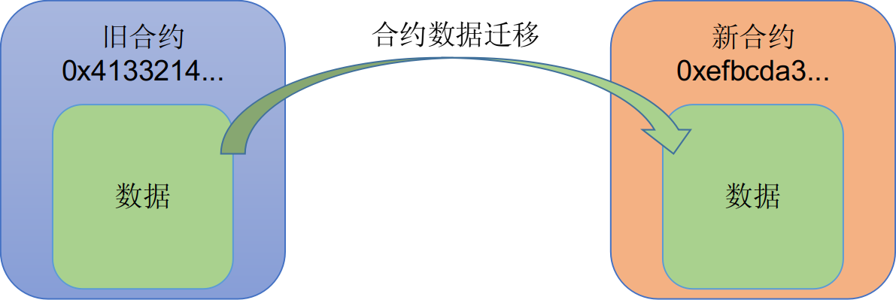

# 合约数据迁移

在数据合约升级的场景，某些情况需要处理历史数据在新旧合约之间的迁移。

PlatONE支持新旧合约之间的数据迁移，以保证合约升级时原有业务数据不丢失。



```
$ctool migInvoke --addr ${destination_contract_addr} --func 'migrateFrom' --param ${source_contract_addr}  --config ${ctool.json}
```

参数说明：

`${destination_contract_addr}` 为要迁入合约的地址

`${source_contract_addr}` 为要迁移的数据源合约

## 示例

我们以迁移一个带数据的CNS合约为例，来描述操作过程：

1. 部署CNS合约 A：

```
$ctool deploy --code ../conf/contracts/cnsManager.wasm --abi ../conf/contracts/cnsManager.cpp.abi.json --config ../conf/ctool.json
```

2. 部署`userRegister`合约，用以在CNS合约 A中写入数据。（在用户场景中，这个步骤可选，只要保证待迁移的合约存在数据即可）

```
$ctool deploy --code ../conf/contracts/userRegister.wasm --abi ../conf/contracts/userRegister.cpp.abi.json --config ../conf/ctool.json
```

3. 部署CNS合约 B：

```
$ctool deploy --code ../conf/contracts/cnsManager.wasm --abi ../conf/contracts/cnsManager.cpp.abi.json --config ../conf/ctool.json
```

4. 执行迁移（拷贝，对原合约数据无影响）：

```
$ctool migInvoke --addr 0x30c9f12cae592610df1a387cfec39db0e64989e4 --func 'migrateFrom("0xe1dcc86f53fcbad47e25e391111b03afc14f1db3")' -config ../conf/ctool.json
```

5. 查看CNS合约 B上的数据，确认数据已得到迁移：

```
$ctool invoke --addr 0x30c9f12cae592610df1a387cfec39db0e64989e4 --abi ../conf/contracts/cnsManager.cpp.abi.json --config ../conf/ctool.json --func getRegisteredContracts --param 0 --param 10
```

   

