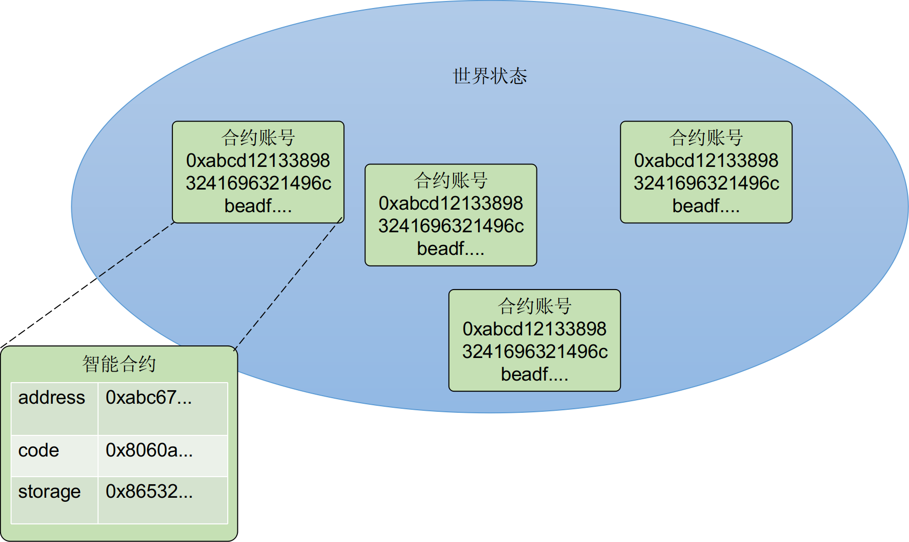
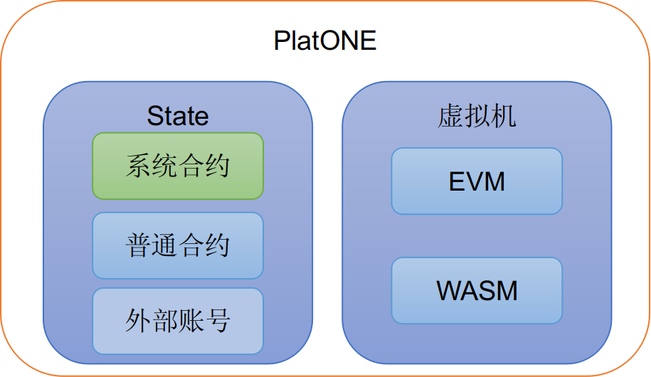

# 智能合约概要

PlatONE中的智能合约是一段可以在链上运行的逻辑代码，合约以账户形式存在，称之为合约账户。合约账户状态的`code`字段中保存了合约的逻辑代码（即字节码），合约的调用可以看做是合约账号中的逻辑代码在虚拟机中执行。

PlatONE同时支持EVM和WASM两种类型智能合约虚拟机，其中EVM虚拟机兼容以太坊的solidity智能合约，WASM虚拟机可以支持C/C++/Rust等多种合约语言。

