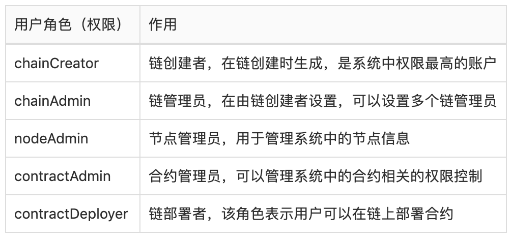
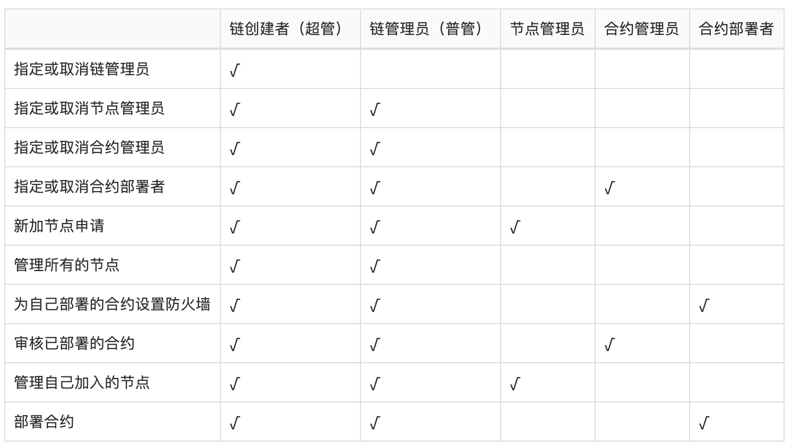
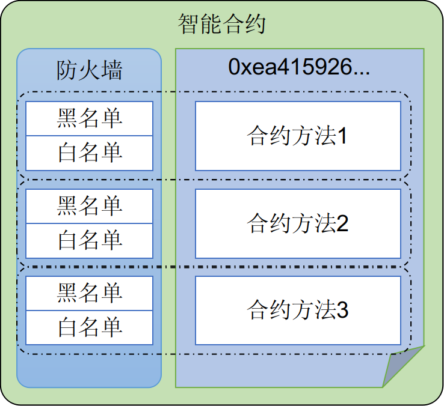

# PlatONE权限模型

根据系统中的不同实体对象，PlatONE将权限管理进行了模块化的拆分。针对系统中用户账户、节点和智能合约这三类实体，分别设计了用户角色管理模块、节点管理模块和合约防火墙模块来进行权限的控制和管理。

+ 角色管理模块：用于管理用户在链上的权限
+ 节点管理模块：用于管理区块链网络中的节点
+ 合约防火墙模块：实现接口级别的合约访问权限

## 1. 角色管理

PlatONE中每种角色对应不同的权限等级，并通过系统合约对用户的角色进行管理，以控制用户的权限。

新用户向系统合约提交注册信息，待链管理员审核通过后，便成为平台用户。用户可以通过用户地址或用户名称来查询或更新用户信息。与此同时，管理员可以禁用、激活以及删除用户。

平台用户可以申请不同的角色，待链管理员审核通过后，被授予对应的角色，并拥有相应的权限。用户可以通过角色管理合约来查询角色，通过用户地址和用户名称两种查询条件查询用户角色信息，是否有某个角色，系统中某个角色的地址。

PlatONE中的权限都是对系统中的用户分配的，用户的角色即表示用户的权限，目前用户可以分配如下角色（权限）。

每个角色的权限范围如下表所示

## 2. 节点管理

为了保证区块链的安全性，PlatONE通过节点管理合约对节点进行管理，包括节点是否能够接入网络，节点是否能够参与共识以及节点信息的维护等功能。根据之前用户角色的设定，只有chainCreator、chainAdmin和nodeAdmin这三类用户才可以设置系统合约中的节点数据，当需要添加节点、更新节点状态、删除节点时都需要这三类账户来调用节点管理合约。需要注意的是nodeAdmin仅可以管理自己加入的节点，chainCreator和chainAdmin可以管理所有节点。

### 2.1 节点类型

#### 观察者节点

观察者节点负责同步区块但并不参与投票出块。 

系统中，将会一直存在几个稳定的观察者节点。 用于其他节点连接，从而进行稳定的同步区块。 新节点启动时，使用bootnodes参数指定**稳点的观察者节点**进行连接，连接成功之后，则可正常同步区块。 稳定的观察者节点设置在genesis.json的suggestObserverNodes中，在链启动之后，需要将所设置的稳定的观察者节点添加到节点管理系统合约中。

#### 共识节点

共识节点参与投票出块，以及同步区块。

在PlatONE刚启动之际，系统合约还并未部署，此时网络中的共识节点将会由genesis.json中validatorNodes中指定的第一个节点来承担。 由此节点进行共识出块。直到PlatONE部署完系统合约，并且成功的在节点管理合约中指定了新的共识节点之后，由合约中指定的多个共识节点进行相互投票和出块。

### 2.2 节点状态

节点状态可以使用节点管理系统合约的相应的API进行设置和更改。

#### 删除状态

删除状态下的节点无法连接其他节点，也无法被其他节点进行连接。 删除状态下的节点将会永久的停留在删除状态，不允许恢复。

#### 正常状态

正常状态下的节点，可以主动连接其他节点，也可以被其他正常状态下的节点进行连接。

### 2.3 节点启动

节点启动时，除了指定PlatONE常规参数外，还需要指定`--bootnodes`，bootnodes指定范围建议是稳定的观察者节点。 可以在genesis.json中suggestObserverNodes中查看到所有的稳定观察者节点。

### 2.4 节点连接

节点A启动后，会主动连接`--bootnodes`指定的节点B，而在节点B中，会检查节点A是否在存在于节点管理合约中，并且节点状态为正常状态。只有检查通过，此时节点B才会接受节点A的连接请求。 当节点成功连接之后，就可以进行同步区块等操作。

### 2.5 节点更新

节点管理合约提供相应的节点更新操作。可以按需更改合约中已添加的节点的状态，类型等节点信息。

## 3. 合约防火墙

合约防火墙主要实现了对防火墙白名单和黑名单的管理功能，使得合约的部署者可以设置合约的防火墙规则，以控制合约方法的调用权限，允许特定的用户调用合约的指定方法，在提高用户体验的同时又有效地提高了安全性能。

PlatONE中合约的调用权限由合约防火墙控制，只有合约的创建者才可以设置该合约的防火墙。

合约防火墙具备合约接口级别的访问控制，通过如下两个列表实现：
    + ACCEPT: 可以访问相应接口的地址列表，相当于白名单
    + REJECT: 拒绝访问相应接口的地址列表，相当于黑名单

