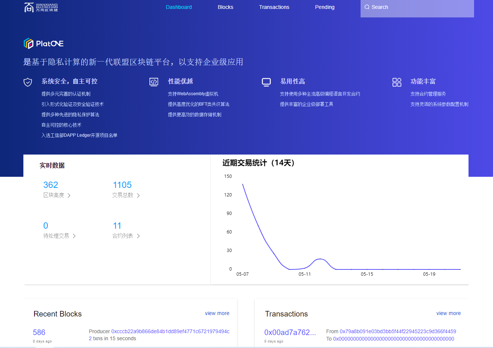

# 区块链浏览器

本项目是platone浏览器项目，兼容浏览器IE9及以上，360浏览器兼容版（IE9内核），360浏览器极速版，chrome浏览器。



## 1. 功能

(1)、主要功能是区块链概览，查看区块，查看交易，查看账户状态。

(2)、区块链概览，查看区块，查看交易和账户页面每10s执行一轮请求。

## 2. 部署

### 2.1. 依赖环境

| 环境  | 版本                |
| ----- | ------------------- |
| nginx | nginx1.6或以上版本  |
| java  | jdk1.8或以上版本    |
| mysql | mysql-5.6或以上版本 |

+ nginx安装请参考附录


### 2.2. 后端配置


代码clone：

```shell
git clone git@172.16.211.192:PlatONE/src/explorer/explore-java.git
```

数据库配置：

```shell
#连接mysql
mysql -u root -p

#导入默认表
use platone_explore;
source ${PathToExplorerProject}/db/bcos_browser_table.sql 
```

java service启动：

修改application.yml：

+ 服务端口配置
+ 数据库连接配置

```java
//服务端口
server:
  port: 9600
spring:
  profiles:
    active: dev      
//数据库配置
  datasource:
    url: jdbc:mysql://127.0.0.1:3306/platone_explore?serverTimezone=Asia/Shanghai&characterEncoding=utf-8&useSSL=false&autoReconnect=true&autoReconnectForPools=true
    username: root
    password: 123456
    driver-class-name: com.mysql.cj.jdbc.Driver
    sql-script-encoding: UTF-8
```

启动java service：

+ 运行BcosBrowserApplication.java

### 2.3. 前端配置

代码clone：

```shell
git clone git@172.16.211.192:PlatONE/src/explorer/client.git
```

编译：

```shell
cd explore/client
npm run build
```

+ 静态资源目录./dist

修改nginx配置

在./doc文件下有nginx配置文件，直接可以拿来替换安装的nginx的配置文件nginx.conf；

**注意**：如果按照附录安装的nginx，配置文件路径在/usr/local/nginx/conf/nginx.conf 。

然后修改nginx.conf；

1. 修改前端服务的ip地址和端口。
2. 修改前端文件的路径,直接指向已拉取代码的dist目录。
3. 修改后端服务的ip和端口，注意'/api'不要修改。

```Nginx
    server {
            listen       8088 default_server;   //步骤1、前端端口
            server_name  192.168.0.1;         //步骤1、前端地址，可配置为域名
            location / {
                    root    /home/explore/client/dist;   //步骤2、前端文件路径
                    index  index.html index.htm;
                    try_files $uri $uri/ /index.html =404;
                }

            # Load configuration files for the default server block.
            include /etc/nginx/default.d/*.conf;

            location /api {
                    proxy_pass    http://192.168.0.1:9600/;    //步骤3、后端服务地址及端口
               	 	proxy_set_header		Host				$host;
                    proxy_set_header		X-Real-IP			$remote_addr;
                    proxy_set_header		X-Forwarded-For		$proxy_add_x_forwarded_for;
            }
            }
```

### 2.4 启动nginx

(1)、启动nginx。
启动命令：

```shell
/usr/local/nginx/sbin/nginx   
```

启动报错重点排查：日志路径是否正确（error.log和access.log），nginx有没有添加用户权限。

(2)、打开页面，页面url是nginx配置的前端端口和前端ip。
例如:上面配置文件的url为   http:192.168.0.1:8088


## 3. 附录

### 3.1 安装nginx（可参考[网络教程](http://www.runoob.com/linux/nginx-install-setup.html)）

#### 3.1.1 下载nginx依赖

在安装nginx前首先要确认系统中安装了gcc、pcre-devel、zlib-devel、openssl-devel。如果没有，请执行命令

	yum -y install gcc pcre-devel zlib-devel openssl openssl-devel

执行命令时注意权限问题，如遇到，请加上sudo

#### 3.1.2 下载nginx

nginx下载地址：https://nginx.org/download/（下载最新稳定版本即可）
或者使用命令：

	wget http://nginx.org/download/nginx-1.10.2.tar.gz  (版本号可换)

将下载的包移动到/usr/local/下

#### 3.1.3. 安装nginx

##### 3.1.3.1. 解压

	tar -zxvf nginx-1.10.2.tar.gz

##### 3.1.3.2. 进入nginx目录

	cd nginx-1.10.2

##### 3.1.3.3. 配置

	./configure --prefix=/usr/local/nginx

##### 3.1.3.4. make

	make
	make install

##### 3.1.3.5. 测试是否安装成功

使用命令：

	/usr/local/nginx/sbin/nginx –t

正常情况的信息输出：

	nginx: the configuration file /usr/local/nginx/conf/nginx.conf syntax is ok
	nginx: configuration file /usr/local/nginx/conf/nginx.conf test is successful

##### 3.1.3.6. nginx几个常见命令

```shell
/usr/local/nginx/sbin/nginx -s reload            # 重新载入配置文件
/usr/local/nginx/sbin/nginx -s reopen            # 重启 Nginx
/usr/local/nginx/sbin/nginx -s stop              # 停止 Nginx
ps -ef | grep nginx                              # 查看nginx进程
```